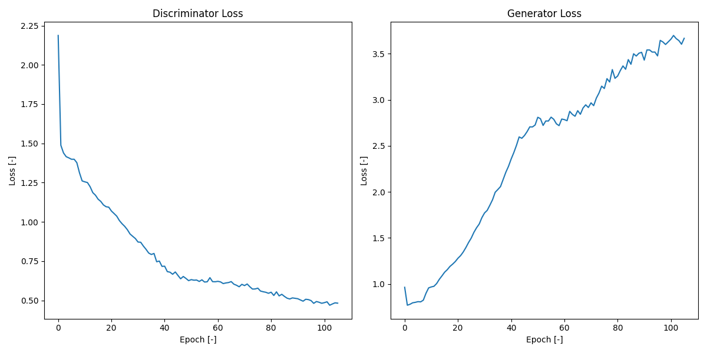
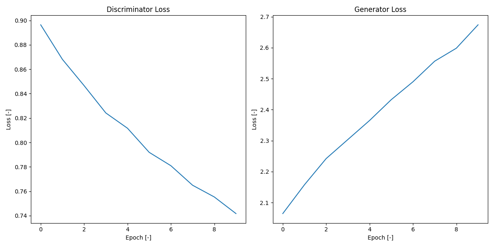
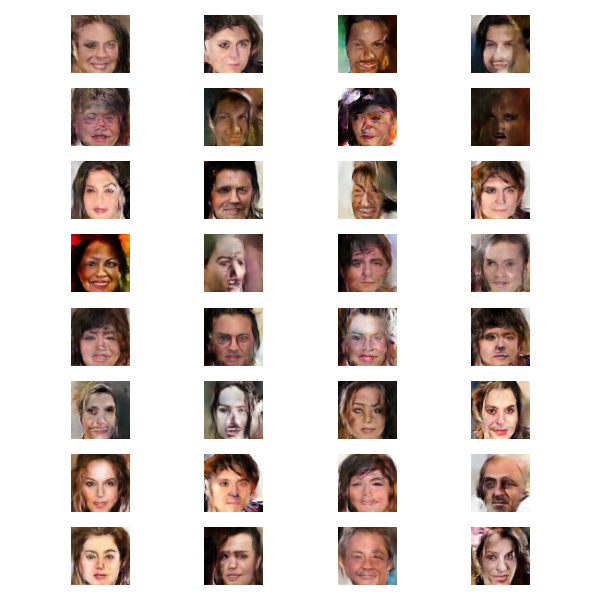
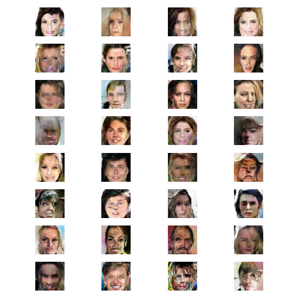
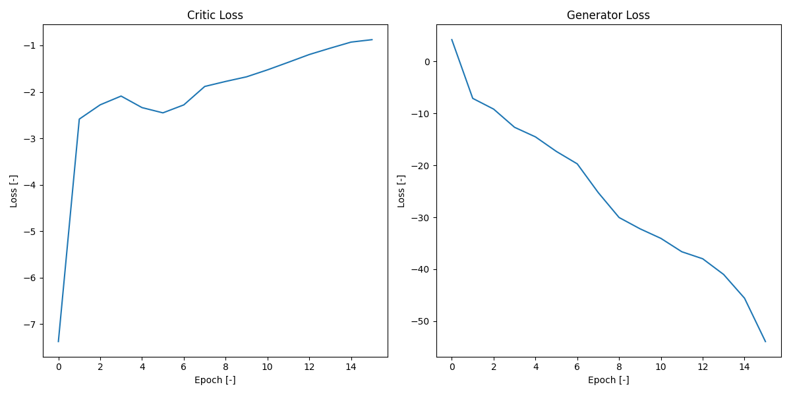
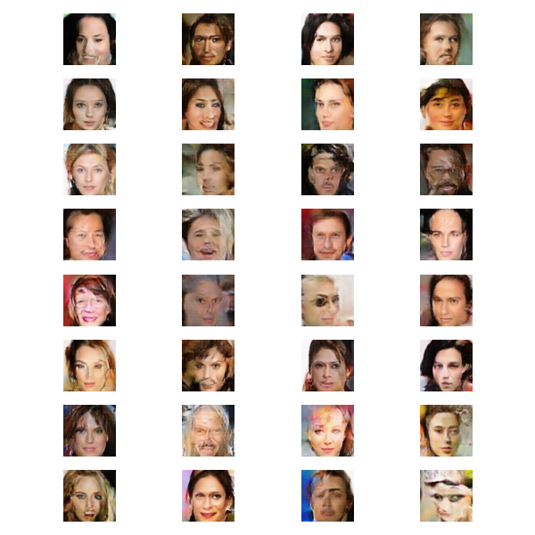
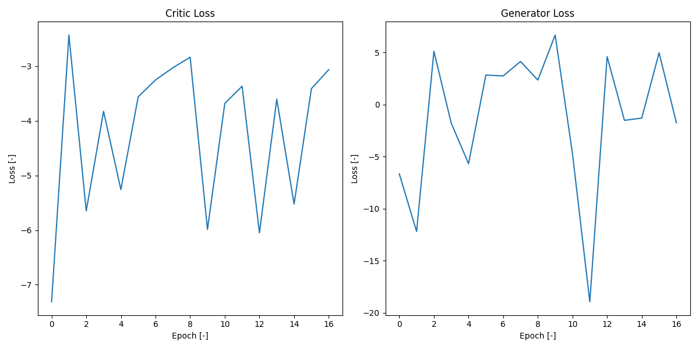
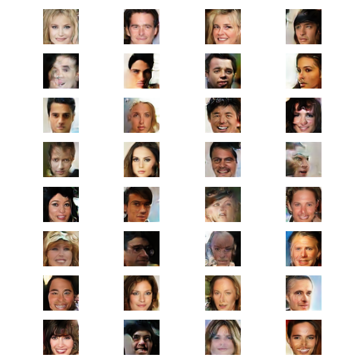

# Face Generating Model

## Short description
In this project I trained DCGAN and WGAN like models using Celeba dataset. The goal was to create a model that can generate decent looking faces, test different architectures, compare results and wrap things up with API and webapp.

[](https://www.youtube.com/watch?v=1fr4Pur50YM)

## Setup
  - ```pip install -r requirements.txt```

## Packages
```
bcrypt==5.0.0
fastapi==0.134.0
flask==3.1.3
keras==3.13.2
matplotlib==3.10.8
numpy==2.4.3
pandas==3.0.2
pydantic==2.12.5
pytest==9.0.2
requests==2.32.5
sqlalchemy==2.0.49
tensorflow==2.21.0
uvicorn==0.42.0
wtforms==3.2.1
```

## About dataset
To train models I used CalebA dataset which contains more than 200K celebrity images, each with 40 attribute annotations. <br> 
See: https://mmlab.ie.cuhk.edu.hk/projects/CelebA.html

## What is GAN?
GAN stands for Generative Adversarial Networks - such models are used to generate artificial data like sound or images. The core idea of GAN is the rivalization of two neural networks - generator, which is used for generating data and discriminator, which is used for rating if the data is fake or not. In the process of training generator is learning to generate more real looking data while discriminator learn to spot the fake ones. <br>
The biggest problem of the regular GAN is it's binary nature, discriminator can only rate image as fake or real (true or false), so in the case of too good discriminator generator stops learning (vanishing gradient). Other problem is mode collapse, in this case model generate limited variants of the data.

### DCGAN
Deep Convolutional Generative Adversarial Network (2015) is a GAN model that uses convolutional layers while the previous GAN models were based on simple Dense layers. Instead of using max-pooling DCGAN uses strided convolutions, both discrimiator and generator use BatchNorm which help stabilize training. As activation function DCGAN uses ReLU in the generator, LeakyReLU in the discriminator while original GAN used Maxout / sigmoid. On generator output DCGAN use tanh instead of sigmoid. As optimizers I've used Adam for both of networks with lr=5e-5, beta_1=0.0, beta_2=0.9 and as loss function I've used BinaryCrossentropy.


#### **My implementation**
*Generator*
```python
def build_discriminator(img_shape=(64, 64, 3)):
    model = tf.keras.Sequential([

        # ── 64x64 → 32x32 ──
        # No BatchNorm on first layer — DCGAN convention.
        layers.Conv2D(64, kernel_size=4, strides=2, padding='same', input_shape=img_shape),

        # LeakyReLU in the discriminator — keeps gradients alive even
        # for negative activations, which helps the generator get
        # learning signal when the discriminator is winning.
        layers.LeakyReLU(0.2),

        # Dropout — regularization to prevent the discriminator from
        # becoming "too confident too fast" (which kills generator
        # gradients). In DCGAN this is fine and helpful; in WGAN-GP
        # it's controversial because it conflicts with GP smoothness.
        layers.Dropout(0.3),

        # ── 32x32 → 16x16 ──
        layers.Conv2D(128, kernel_size=4, strides=2, padding='same'),
        layers.BatchNormalization(),
        layers.LeakyReLU(0.2),
        layers.Dropout(0.3),

        # ── 16x16 → 8x8 ──
        layers.Conv2D(256, kernel_size=4, strides=2, padding='same'),
        layers.BatchNormalization(),
        layers.LeakyReLU(0.2),
        layers.Dropout(0.3),

        layers.Flatten(),

        # Sigmoid output → probability in [0, 1].
        # This is the KEY difference from WGAN's critic, which outputs
        # an unbounded score. Sigmoid + binary crossentropy is what
        # creates the "vanishing gradient" problem when the discriminator
        # gets too confident — it saturates near 0 or 1 and the generator
        # stops learning.
        layers.Dense(1, activation='sigmoid'),
    ], name="discriminator")
    return model
```
*Discriminator*
```python
def build_discriminator(img_shape=(64, 64, 3)):
    model = tf.keras.Sequential([

        # ── 64x64 → 32x32 ──
        # No BatchNorm on first layer — DCGAN convention.
        layers.Conv2D(64, kernel_size=4, strides=2, padding='same', input_shape=img_shape),

        # LeakyReLU in the discriminator — keeps gradients alive even
        # for negative activations, which helps the generator get
        # learning signal when the discriminator is winning.
        layers.LeakyReLU(0.2),

        # Dropout — regularization to prevent the discriminator from
        # becoming "too confident too fast" (which kills generator
        # gradients). In DCGAN this is fine and helpful; in WGAN-GP
        # it's controversial because it conflicts with GP smoothness.
        layers.Dropout(0.3),

        # ── 32x32 → 16x16 ──
        layers.Conv2D(128, kernel_size=4, strides=2, padding='same'),
        layers.BatchNormalization(),
        layers.LeakyReLU(0.2),
        layers.Dropout(0.3),

        # ── 16x16 → 8x8 ──
        layers.Conv2D(256, kernel_size=4, strides=2, padding='same'),
        layers.BatchNormalization(),
        layers.LeakyReLU(0.2),
        layers.Dropout(0.3),

        layers.Flatten(),

        # Sigmoid output → probability in [0, 1].
        # This is the KEY difference from WGAN's critic, which outputs
        # an unbounded score. Sigmoid + binary crossentropy is what
        # creates the "vanishing gradient" problem when the discriminator
        # gets too confident — it saturates near 0 or 1 and the generator
        # stops learning.
        layers.Dense(1, activation='sigmoid'),
    ], name="discriminator")
    return model
```
*Model class*
```python
class DCGAN(tf.keras.Model):
    def __init__(self, generator, discriminator, latent_dim):
        super().__init__()
        self.generator     = generator
        self.discriminator = discriminator
        self.latent_dim    = latent_dim

    def compile(self, gen_optimizer, disc_optimizer, loss_fn):
        super().compile()
        self.gen_optimizer  = gen_optimizer
        self.disc_optimizer = disc_optimizer
        self.loss_fn        = loss_fn
        self.gen_loss_metric  = tf.keras.metrics.Mean(name="gen_loss")
        self.disc_loss_metric = tf.keras.metrics.Mean(name="disc_loss")

    @property
    def metrics(self):
        return [self.gen_loss_metric, self.disc_loss_metric]

    def train_step(self, real_images):
        batch_size = tf.shape(real_images)[0]

        # Generate random noise vectors — one per image in the batch
        # This is the generator's "seed" — different noise = different face
        # It's basically random float in array of shape (64, 100)
        noise = tf.random.normal([batch_size, self.latent_dim])

        # GradientTape records all operations inside the block
        # so it can compute gradients (how much to adjust each weight)
        # Two separate tapes — one per model, because they update independently
        with tf.GradientTape() as gen_tape, tf.GradientTape() as disc_tape:

            # Generator produces fake images from noise
            # training=True enables BatchNormalization and Dropout
            fake_images = self.generator(noise, training=True)

            # Discriminator evaluates both real and fake images
            # real_output — scores for images from the dataset
            # fake_output — scores for images produced by generator
            real_output = self.discriminator(real_images, training=True)
            fake_output = self.discriminator(fake_images, training=True)


            # Discriminator loss — it wants to:
            # - output 1.0 for real images (tf.ones_like)
            # - output 0.0 for fake images (tf.zeros_like)

            # Label smoothing — dyskryminator nigdy nie jest w 100% pewny
            real_labels = tf.ones_like(real_output) * 0.9   # ← zamiast ones_like
            fake_labels = tf.zeros_like(fake_output)         # ← fake zostawiamy 0.0

            # ones_like - converts every value in array to 1
            # zeros_like - converts every value in array to 0
            # disc_loss = (
            #     self.loss_fn(tf.ones_like(real_output),  real_output) +
            #     self.loss_fn(tf.zeros_like(fake_output), fake_output)
            # )

            disc_loss = (
                self.loss_fn(real_labels, real_output) +
                self.loss_fn(fake_labels, fake_output)
            )

            """
            self.loss_fn(tf.ones_like(real_output),  real_output)
            +
            self.loss_fn(tf.zeros_like(fake_output), fake_output)

            # Real images — the classifier should output 1.0
            ones_like  = [[1.0], [1.0], [1.0], [1.0]]  # expected
            real_output = [[0.9], [0.3], [0.8], [0.6]]  # actual scores

            # loss is high for 0.3 (it was very wrong)
            # loss is low for 0.9 (it was almost right)

            # Fake images — the discriminator should say 0.0
            zeros_like  = [[0.0], [0.0], [0.0], [0.0]]  # expected
            fake_output = [[0.1], [0.7], [0.2], [0.4]]  # actual scores

            # loss is high for 0.7 (it was fooled by the generator)
            # loss is small for 0.1 (it correctly detected the fake image)

            we sum it up, because discriminator has 2 tasks - recognizing real images as real
            and fake ones as fake
            """

            # Generator loss — it wants discriminator to output 1.0 for fake images
            # i.e. fool the discriminator into thinking fakes are real
            gen_loss = self.loss_fn(tf.ones_like(fake_output), fake_output)

        # Compute gradients — how much should each weight change
        # each model only updates its own weights, not the other's
        gen_grads  = gen_tape.gradient(gen_loss,  self.generator.trainable_variables)
        disc_grads = disc_tape.gradient(disc_loss, self.discriminator.trainable_variables)

        # Apply gradients — actually update the weights
        self.gen_optimizer.apply_gradients(zip(gen_grads,  self.generator.trainable_variables))
        self.disc_optimizer.apply_gradients(zip(disc_grads, self.discriminator.trainable_variables))

        # Update metrics visible in model.fit progress bar
        self.gen_loss_metric.update_state(gen_loss)
        self.disc_loss_metric.update_state(disc_loss)

        return {m.name: m.result() for m in self.metrics}
```

#### **Hiperparameters**
- **IMG_SIZE** = 64
- **BATCH_SIZE** = 128
- **AUTOTUNE** = tf.data.AUTOTUNE
- **LATENT_DIM** = 100
- **EPOCHS** = 100
- **LEARNING_RATE** = 5e-5

#### **Training metrics**

**100+ epochs**


**30 epochs**

Discriminator dominates over generator in both cases but as we can see, the more training the worse it gets.

#### **Samples**

**100+ epochs**



**30 epochs**



## What is WGAN?
Wasserstein GAN (2017), it is upgraded version of GAN which solved problems of regular GAN or DCGAN models such as mode collapse and unstable training. It is possible thanks to the Wasserstein loss function and replacing discriminator with critic which instead of saying "fake or real" it gives score to each image, so generator gets more detailed feedback and in the result it learns better. Another usefull type of WGAN is WGAN-GP which uses gradient penalty that punishes the critic if its gradients get too steep.

### WGAN 2.5
WGAN v2.5 is a "no-frills" WGAN-GP implementation — a clean baseline that fixes the mistakes of a regular GAN/DCGAN without adding any architectural extras.

What was done:
- **Wasserstein loss + Gradient Penalty** instead of binary crossentropy — continuous score replaces fake/real classification, and GP enforces the 1-Lipschitz constraint on the critic.
- **LayerNorm replaces BatchNorm** in the generator — BatchNorm breaks GP because it makes samples in a batch dependent on each other, while GP requires per-sample independence.
- **No sigmoid on the critic output** — it returns an unbounded real number (a score), not a probability.
- **kernel=4, stride=2** in all up/downsampling layers — kernel size divides evenly by stride, eliminating checkerboard artifacts that appear with kernel=3.
- **Separate RGB projection** at the end of the generator — the final upsample and the conversion to 3 channels are split into two layers for cleaner output.
- **Adam with beta_1=0** — momentum harms WGAN-GP training (it causes oscillations between generator and critic), so it's removed.
- **Critic trains 5 steps per 1 generator step** — standard WGAN-GP recipe to keep the critic near-optimal.
- **Dropout kept in the critic** — technically conflicts with GP smoothness in theory, but in practice it stabilized training on CelebA for this model size, so it stayed.

What was NOT done (intentionally):
- **No Self-Attention** — would significantly slow training (~3x) for marginal quality gain at 64x64.
- **No additional "detail" conv layers between upsamples** — kept the generator shallow and fast.
- **No bilinear UpSampling + Conv** — stayed with Conv2DTranspose since kernel=4/stride=2 already prevents most artifacts.
- **No EMA on generator weights** — could be added later as a post-training quality boost.
- **No DiffAugment / data augmentation** — the CelebA dataset is large enough that augmentation isn't critical here.

The result: a model that trains in ~15 minutes per epoch (vs ~40 min for v4), with stable loss curves and consistent sample quality. Best samples aren't quite as sharp as v4's, but the median sample quality is higher and the "ugly tail" is much shorter.

#### **My implementation**
*Generator*
```python
def build_generator(latent_dim=128):
    gen_input = tf.keras.Input(shape=(latent_dim,))

    # latent_dim = "latent dimension" — 128 independent "knobs" of
    # randomness, each sampled from N(0,1). Different knob settings
    # → different face. The generator learns during training which
    # knob controls which feature (smile, hair length, glasses, ...).
    #
    # Why two layers? Convs need a 4D tensor (batch, H, W, channels)
    # — they can't run on a flat vector. Dense learns to map the
    # noise into 16384 activations; Reshape just reinterprets them
    # as an 8x8x256 cube (zero params, zero compute).

    # 256 channels = starting capacity; halves at each upsample
    # (256→128→64→32). 8x8 because we upsample x2 three times → 64x64.
    # 8x8 because we'll upsample x2 (strides=2) three times to reach 64x64.
    x = layers.Dense(8 * 8 * 256, use_bias=False)(gen_input)
    x = layers.Reshape((8, 8, 256))(x)

    # LayerNorm (NOT BatchNorm!) — BatchNorm breaks Gradient Penalty
    # because GP needs each sample to be independent of others in the
    # batch, but BN makes them depend on each other through batch stats.
    x = layers.LayerNormalization()(x)

    # LeakyReLU instead of ReLU — keeps a tiny slope (0.2) on negatives
    # so gradients always flow. ReLU can "kill" neurons by zeroing them.
    x = layers.LeakyReLU(0.2)(x)

    # ── 8x8 → 16x16 ──
    # Conv2DTranspose = "convolution in reverse", doubles resolution
    # while learning what to fill in the new pixels.
    # kernel=4 with stride=2 — the kernel size MUST be divisible by
    # stride, otherwise you get checkerboard artifacts (those weird
    # grid patterns in GAN outputs). kernel=3, stride=2 = artifacts.
    # kernel=4, stride=2 = clean.
    x = layers.Conv2DTranspose(128, kernel_size=4, strides=2,
                               padding='same', use_bias=False)(x)
    x = layers.LayerNormalization()(x)
    x = layers.LeakyReLU(0.2)(x)

    # ── 16x16 → 32x32 ──
    x = layers.Conv2DTranspose(64, kernel_size=4, strides=2,
                               padding='same', use_bias=False)(x)
    x = layers.LayerNormalization()(x)
    x = layers.LeakyReLU(0.2)(x)

    # ── 32x32 → 64x64 ──
    x = layers.Conv2DTranspose(32, kernel_size=4, strides=2,
                               padding='same', use_bias=False)(x)
    x = layers.LayerNormalization()(x)
    x = layers.LeakyReLU(0.2)(x)

    # ── Final RGB projection ──
    # Separate layer (not merged with the last upsample) for cleaner
    # output — combining upsample and channel reduction in one step
    # tends to produce visible artifacts.
    # tanh squashes output to [-1, 1], matching how training images
    # are normalized.
    fake_images = layers.Conv2D(3, kernel_size=3, padding='same',
                                activation='tanh')(x)

    return tf.keras.Model(gen_input, fake_images, name="generator")
```
*Critic*
```python
def build_critic(img_shape=(64, 64, 3)):
    disc_input = tf.keras.Input(shape=img_shape)

    # ── 64x64 → 32x32 ──
    # kernel=4 with stride=2 — same reasoning as in the generator,
    # clean math, no gradient artifacts.
    # No LayerNorm on the first layer — standard practice.
    x = layers.Conv2D(64, kernel_size=4, strides=2, padding='same')(disc_input)
    x = layers.LeakyReLU(0.2)(x)

    # Dropout in the critic — controversial in WGAN-GP theory because
    # GP enforces a smoothness constraint on the critic, and dropout
    # adds randomness that fights against it. BUT in practice, for
    # small models on CelebA, dropout stabilizes training. We tested
    # both with and without — dropout version converges more reliably.
    x = layers.Dropout(0.2)(x)

    # ── 32x32 → 16x16 ──
    x = layers.Conv2D(128, kernel_size=4, strides=2, padding='same')(x)
    x = layers.LayerNormalization()(x)
    x = layers.LeakyReLU(0.2)(x)
    x = layers.Dropout(0.2)(x)

    # ── 16x16 → 8x8 ──
    x = layers.Conv2D(256, kernel_size=4, strides=2, padding='same')(x)
    x = layers.LayerNormalization()(x)
    x = layers.LeakyReLU(0.2)(x)
    x = layers.Dropout(0.2)(x)

    # ── 8x8 → 4x4 ──
    x = layers.Conv2D(256, kernel_size=4, strides=2, padding='same')(x)
    x = layers.LayerNormalization()(x)
    x = layers.LeakyReLU(0.2)(x)
    x = layers.Dropout(0.2)(x)

    x = layers.Flatten()(x)

    # Dense(1) — single scalar score. NO sigmoid! Unlike a regular GAN
    # discriminator that outputs a probability in [0,1], the critic
    # outputs an unbounded real number. Higher = more "real-looking".
    x = layers.Dense(1)(x)

    return tf.keras.Model(disc_input, x, name="critic")
```

*Model class*
```python
class WGAN(tf.keras.Model):
    def __init__(self, generator, critic, latent_dim, critic_steps=5, gp_weight=10.0):
        super().__init__()
        self.generator = generator
        self.critic = critic
        self.latent_di = latent_dim
        self.critic_steps = critic_steps
        self.gp_weight = gp_weight

    def compile(self, gen_optimizer, critic_optimizer):
        super().compile()
        self.gen_optimizer = gen_optimizer
        self.critic_optimizer = critic_optimizer
        self.gen_loss_metric = tf.keras.metrics.Mean(name="gen_loss")
        self.critic_loss_metric = tf.keras.metrics.Mean(name="critic_loss")

    @property
    def metrics(self):
        return [self.gen_loss_metric, self.critic_loss_metric]

    def gradient_penalty(self, real_images, fake_images, batch_size):
        # A random point between the real and the fake image
        alpha = tf.random.uniform([batch_size, 1, 1, 1], 0.0, 1.0)
        interpolated = real_images + alpha * (fake_images - real_images)

        with tf.GradientTape() as tape:
            tape.watch(interpolated)
            pred = self.critic(interpolated, training=True)

        grads = tape.gradient(pred, interpolated)
        norm  = tf.sqrt(tf.reduce_sum(tf.square(grads), axis=[1, 2, 3]))

        # Punish gradient norm differs from 1
        return tf.reduce_mean((norm - 1.0) ** 2)

    def train_step(self, real_images):
        batch_size = tf.shape(real_images)[0]

        for _ in range(self.critic_steps):
            noise = tf.random.normal([batch_size, self.latent_dim])
            with tf.GradientTape() as critic_tape:
                fake_images = self.generator(noise, training=True)
                real_output = self.critic(real_images, training=True)
                fake_output = self.critic(fake_images, training=True)

                # Wasserstein loss
                critic_loss = tf.reduce_mean(fake_output) - tf.reduce_mean(real_output)

                # Gradient penalty
                gp = self.gradient_penalty(real_images, fake_images, batch_size)
                critic_loss = critic_loss + self.gp_weight * gp

            critic_grads = critic_tape.gradient(critic_loss, self.critic.trainable_variables)
            self.critic_optimizer.apply_gradients(zip(critic_grads, self.critic.trainable_variables))

        noise = tf.random.normal([batch_size, self.latent_dim])
        with tf.GradientTape() as gen_tape:
            fake_images = self.generator(noise, training=True)
            fake_output = self.critic(fake_images, training=True)

            # Generator chce żeby krytyk dawał wysokie oceny fałszywym obrazom
            gen_loss = -tf.reduce_mean(fake_output)

        gen_grads = gen_tape.gradient(gen_loss, self.generator.trainable_variables)
        self.gen_optimizer.apply_gradients(zip(gen_grads, self.generator.trainable_variables))

        self.gen_loss_metric.update_state(gen_loss)
        self.critic_loss_metric.update_state(critic_loss)
        return {m.name: m.result() for m in self.metrics}
```

#### **Hiperparameters**
- **IMG_SIZE** = 64
- **BATCH_SIZE** = 128
- **AUTOTUNE** = tf.data.AUTOTUNE
- **LATENT_DIM** = 128
- **EPOCHS** = 30
- **LEARNING_RATE** = 5e-5

#### **Training metrics**
*wgan_2_5_3_generator.h5*

Generator dominates over critic
 
#### **Samples**
*wgan_2_5_3_generator.h5*


When compering to DCGAN we can see more real looking faces overall and less noise/artifacts.

### WGAN 4
WGAN v4 is the "maximum quality" version — keeps the WGAN-GP foundations from v2.5 and adds modern architectural tricks borrowed from SAGAN and StyleGAN. Trades training speed (~3x slower per epoch) for sharper samples with better global consistency. The main upgrade was addition of Self-Attention layer at the 32x32 resolution in both critic and generator. Self-Attention helps to capture long-range relationships by letting pixels to compare itself to other pixels in one one operation, while standard cnn layers only see a small local window, so do the same it would be necessarily to stack multiple layers which would be slow. Next factor is UpSampling2D + Conv2D instead of Conv2DTranspose, because even with `kernel=4, stride=2`, transposed convolutions can still produce subtle checkerboard artifacts. v4 splits each upsampling into two cleaner steps:
1. **Bilinear `UpSampling2D`** — pure interpolation, no learnable parameters, no artifacts.
2. **Regular `Conv2D` with stride=1** — refines the upsampled features.

The other factor is additional  "detail" conv layers between upsamples
Between each upsampling step, v4 inserts an extra `Conv2D` with stride=1 (no resolution change). These act as "refinement" passes — the network gets an opportunity to polish features at the current scale before zooming further in. Adds depth without changing the spatial structure. Another thing is not using dropouts in the critic, because with Self-Attention adding implicit regularization through global feature mixing, the dropout that helped stabilize v2.5 is no longer needed.

#### **My implementation**
*Self-Attention*
```python
class SelfAttention(tf.keras.layers.Layer):
    def __init__(self, channels, **kwargs):
        super().__init__(**kwargs)
        self.channels = channels

        # Q and K are only used to compute similarities (dot products),
        # so they don't need full channel depth. Using channels//8 makes
        # attention 8x faster / 8x less memory with no quality loss.
        # V keeps full channels — it carries the actual info being mixed.
        self.q = layers.Conv2D(channels // 8, 1, padding='same')  # "what am I looking for?"
        self.k = layers.Conv2D(channels // 8, 1, padding='same')  # "what do I represent?"
        self.v = layers.Conv2D(channels,      1, padding='same')  # "what info do I carry?"

        # gamma starts at 0 → attention contributes nothing initially,
        # the layer is a pass-through. The network learns how much
        # attention to use by gradually growing gamma. This is critical:
        # attention can hurt early in training when features are chaotic.
        self.gamma = tf.Variable(0.0, trainable=True, dtype=tf.float32)

    def call(self, x):
        b = tf.shape(x)[0]
        h = tf.shape(x)[1]
        w = tf.shape(x)[2]
        c = x.shape[3]

        # Flatten spatial dims so we can do matrix multiplication
        # across all "pixels" at once: [batch, H*W, channels]
        q = tf.reshape(self.q(x), [b, h*w, c//8])
        k = tf.reshape(self.k(x), [b, h*w, c//8])
        v = tf.reshape(self.v(x), [b, h*w, c])

        # For each pixel i: how similar is it to each other pixel j?
        # softmax(Q · K^T) gives a (H*W) x (H*W) attention matrix
        # where row i = "how much should pixel i listen to pixel j?"
        attn = tf.nn.softmax(tf.matmul(q, k, transpose_b=True))

        # Each pixel becomes a weighted mix of ALL pixels' values,
        # weighted by similarity. Symmetric features get aligned.
        out = tf.matmul(attn, v)
        out = tf.reshape(out, [b, h, w, c])

        # Residual connection: gamma * attention + original input.
        # Network can choose to ignore attention by keeping gamma small.
        return self.gamma * out + x

    def get_config(self):  # needed for save/load
        config = super().get_config()
        config.update({"channels": self.channels})
        return config
```

*Critic*
```python
def build_critic(img_shape=(64, 64, 3)):
    disc_input = tf.keras.Input(shape=img_shape)

    # ── 64x64 → 32x32 ──
    # kernel=4 with stride=2 — clean math, divides evenly. kernel=3
    # with stride=2 produces gradient artifacts for the same reason
    # Conv2DTranspose does in the generator.
    # No LayerNorm on the first layer — standard practice.
    x = layers.Conv2D(64, kernel_size=4, strides=2, padding='same')(disc_input)
    x = layers.LeakyReLU(0.2)(x)

    # Self-Attention at 32x32, symmetric to the generator. The critic
    # also needs to see global structure — to verify symmetric eyes,
    # consistent hair color, anatomical correctness across the face.
    x = SelfAttention(channels=64)(x)

    # ── 32x32 → 16x16 ──
    x = layers.Conv2D(128, kernel_size=4, strides=2, padding='same')(x)
    x = layers.LayerNormalization()(x)
    x = layers.LeakyReLU(0.2)(x)

    # ── 16x16 → 8x8 ──
    x = layers.Conv2D(256, kernel_size=4, strides=2, padding='same')(x)
    x = layers.LayerNormalization()(x)
    x = layers.LeakyReLU(0.2)(x)

    # ── 8x8 → 4x4 ──
    x = layers.Conv2D(256, kernel_size=4, strides=2, padding='same')(x)
    x = layers.LayerNormalization()(x)
    x = layers.LeakyReLU(0.2)(x)

    # No Dropout anywhere in the critic — in WGAN-GP it adds randomness
    # to a function whose smoothness GP is trying to control. They fight
    # each other. (In a regular GAN discriminator, dropout is fine.)

    x = layers.Flatten()(x)

    # Dense(1) — single scalar score. NO sigmoid! Unlike a regular GAN
    # discriminator that outputs a probability in [0,1], the critic
    # outputs an unbounded real number. Higher = more "real-looking".
    x = layers.Dense(1)(x)

    return tf.keras.Model(inputs=disc_input, outputs=x, name="critic")
```

*Generator*

```python
def build_generator(latent_dim=LATENT_DIM):
    gen_input = tf.keras.Input(shape=(latent_dim,))

    # Project the latent_dim-d noise vector into an 8x8x256 feature volume.
    # Think of each of the 256 channels as a low-res "sketch" of some
    # face aspect (eyes location, skin tone, hair direction, ...).
    #
    # Why these two layers?
    # Convolutional layers can't operate on a 1D vector — they need a
    # 4D tensor (batch, H, W, channels). So before any conv can run,
    # we need to give the noise some spatial shape.
    #
    # Dense:    learns a (latent_dim x 16384) matrix that maps the
    #           noise vector into 16384 activations. This is where
    #           the actual "unpacking" of the latent code happens.
    # Reshape:  zero parameters, zero compute — just reinterprets
    #           those 16384 numbers as an 8x8x256 cube so convs can
    #           start working.
    #
    # Note: 16384 = 8*8*256 is fixed by the decoder's starting shape,
    # NOT by latent_dim. Whether latent_dim is 64, 128, or 512, this
    # layer always outputs 16384 — only the Dense matrix size changes.
    # # 256 channels = starting capacity; halves at each upsample
    # 8x8 because we r gonna upsample x (strides=2) three times to reach 64x64.
    x = layers.Dense(8 * 8 * 256, use_bias=False)(gen_input)
    x = layers.Reshape((8, 8, 256))(x)

    # LayerNorm (NOT BatchNorm!) — BatchNorm breaks Gradient Penalty
    # because GP needs each sample to be independent of others in the
    # batch, but BN makes them depend on each other through batch stats.
    x = layers.LayerNormalization()(x)

    # LeakyReLU instead of ReLU — keeps a tiny slope (0.2) on negatives
    # so gradients always flow. ReLU can "kill" neurons by zeroing them.
    x = layers.LeakyReLU(0.2)(x)

    # ── 8x8 detail layer — refine the sketch before zooming in ──
    # Conv with stride=1 doesn't change resolution, just polishes
    # features at the current scale. Like an artist adding lines.
    x = layers.Conv2D(256, 3, padding='same', use_bias=False)(x)
    x = layers.LayerNormalization()(x)
    x = layers.LeakyReLU(0.2)(x)

    # ── 8x8 → 16x16 upsampling ──
    # UpSampling2D + Conv2D, NOT Conv2DTranspose. Why?
    # Conv2DTranspose with stride=2 produces "checkerboard artifacts"
    # — those weird grid patterns in GAN outputs. Bilinear upsampling
    # followed by a regular conv has no such issue. Modern GANs
    # (StyleGAN, etc.) all do it this way.
    x = layers.UpSampling2D(interpolation='bilinear')(x)
    x = layers.Conv2D(128, 3, padding='same', use_bias=False)(x)
    x = layers.LayerNormalization()(x)
    x = layers.LeakyReLU(0.2)(x)

    # 16x16 detail layer
    x = layers.Conv2D(128, 3, padding='same', use_bias=False)(x)
    x = layers.LayerNormalization()(x)
    x = layers.LeakyReLU(0.2)(x)

    # ── 16x16 → 32x32 ──
    x = layers.UpSampling2D(interpolation='bilinear')(x)
    x = layers.Conv2D(64, 3, padding='same', use_bias=False)(x)
    x = layers.LayerNormalization()(x)
    x = layers.LeakyReLU(0.2)(x)

    # 32x32 detail layer
    x = layers.Conv2D(64, 3, padding='same', use_bias=False)(x)
    x = layers.LayerNormalization()(x)
    x = layers.LeakyReLU(0.2)(x)

    # ── Self-Attention at 32x32 ──
    # Sweet spot: enough spatial detail to benefit from global mixing,
    # but small enough to be feasible (the attention matrix is
    # (H*W) x (H*W) = 1024x1024 here; at 64x64 it would be 4096x4096).
    x = SelfAttention(channels=64)(x)

    # ── 32x32 → 64x64 ──
    # Note: upsample is SEPARATE from the final RGB projection.
    # Doing both at once produces visible artifacts; splitting gives
    # cleaner output.
    x = layers.UpSampling2D(interpolation='bilinear')(x)
    x = layers.Conv2D(32, 3, padding='same', use_bias=False)(x)
    x = layers.LayerNormalization()(x)
    x = layers.LeakyReLU(0.2)(x)

    # ── Final RGB projection ──
    # Squash 32 channels down to 3 (R, G, B). tanh maps output to
    # [-1, 1], matching how training images are normalized.
    fake_images = layers.Conv2D(3, 3, padding='same', activation='tanh')(x)

    return tf.keras.Model(inputs=gen_input, outputs=fake_images, name="generator")
```

*Model class*
```python
class WGAN(tf.keras.Model):
    def __init__(self, generator, critic, latent_dim, critic_steps=5, gp_weight=10.0):
        super().__init__()
        self.generator = generator
        self.critic = critic
        self.latent_di = latent_dim
        self.critic_steps = critic_steps
        self.gp_weight = gp_weight

    def compile(self, gen_optimizer, critic_optimizer):
        super().compile()
        self.gen_optimizer = gen_optimizer
        self.critic_optimizer = critic_optimizer
        self.gen_loss_metric = tf.keras.metrics.Mean(name="gen_loss")
        self.critic_loss_metric = tf.keras.metrics.Mean(name="critic_loss")

    @property
    def metrics(self):
        return [self.gen_loss_metric, self.critic_loss_metric]

    def gradient_penalty(self, real_images, fake_images, batch_size):
        # Losowy punkt między prawdziwym a fałszywym obrazem
        alpha = tf.random.uniform([batch_size, 1, 1, 1], 0.0, 1.0)
        interpolated = real_images + alpha * (fake_images - real_images)

        with tf.GradientTape() as tape:
            tape.watch(interpolated)
            pred = self.critic(interpolated, training=True)

        grads = tape.gradient(pred, interpolated)
        norm  = tf.sqrt(tf.reduce_sum(tf.square(grads), axis=[1, 2, 3]))

        # Kara gdy norma gradientu odbiega od 1
        return tf.reduce_mean((norm - 1.0) ** 2)

    def train_step(self, real_images):
        batch_size = tf.shape(real_images)[0]

        # ── Krytyk — 5 kroków ──
        for _ in range(self.critic_steps):
            noise = tf.random.normal([batch_size, self.latent_dim])
            with tf.GradientTape() as critic_tape:
                fake_images = self.generator(noise, training=True)
                real_output = self.critic(real_images, training=True)
                fake_output = self.critic(fake_images, training=True)

                # Wasserstein loss — krytyk maksymalizuje różnicę
                critic_loss = tf.reduce_mean(fake_output) - tf.reduce_mean(real_output)

                # Gradient penalty — wymusza stabilność gradientu
                gp = self.gradient_penalty(real_images, fake_images, batch_size)
                critic_loss = critic_loss + self.gp_weight * gp

            critic_grads = critic_tape.gradient(critic_loss, self.critic.trainable_variables)
            self.critic_optimizer.apply_gradients(zip(critic_grads, self.critic.trainable_variables))

        # ── Generator — 1 krok ──
        noise = tf.random.normal([batch_size, self.latent_dim])
        with tf.GradientTape() as gen_tape:
            fake_images = self.generator(noise, training=True)
            fake_output = self.critic(fake_images, training=True)

            # Generator chce żeby krytyk dawał wysokie oceny fałszywym obrazom
            gen_loss = -tf.reduce_mean(fake_output)

        gen_grads = gen_tape.gradient(gen_loss, self.generator.trainable_variables)
        self.gen_optimizer.apply_gradients(zip(gen_grads, self.generator.trainable_variables))

        self.gen_loss_metric.update_state(gen_loss)
        self.critic_loss_metric.update_state(critic_loss)
        return {m.name: m.result() for m in self.metrics}
```

#### **Hiperparameters**
- **IMG_SIZE** = 64
- **BATCH_SIZE** = 64
- **AUTOTUNE** = tf.data.AUTOTUNE
- **LATENT_DIM** = 100
- **EPOCHS** = 30
- **LEARNING_RATE** = 5e-5

#### **Training metrics**
*wganv4_1_generator.h5*


Training is more chaotic.

#### **Training metrics**
*wganv4_1_generator.h5*


Some samples are even sharper when compering to wgan 2.5, but "ugly tail" of bad looking samples is longer.


## Why LeakyReLU in the generator?
The generator builds an image from scratch through many stacked layers. If ReLU zeros out activations early in the network, those "dead" pathways stay dead for the rest of the forward pass — the generator loses capacity to represent certain features. LeakyReLU's small negative slope (0.2) keeps every neuron alive and contributing, so the full network capacity is used.

## Why ReLU in the discriminator/critic?
The discriminator only needs to output a single decision (real/fake or a score). It can afford to "drop" features by zeroing them — that's actually useful as implicit feature selection. Plain ReLU works fine here, though many modern GANs (including our WGANs) use LeakyReLU in both networks for symmetry and slightly better gradient flow back to the generator.

## Why tanh on the generator output?
Tanh squashes values to **[-1, 1]**, matching how training images are normalized (pixels scaled from [0, 255] → [-1, 1]). This means the generator's output range and the real images' range are identical — the discriminator can't trivially distinguish "fake" images by their pixel range. Sigmoid (output [0, 1]) would also work but gives weaker gradients near 0 and 1; tanh is symmetric around 0 with better gradient flow.
